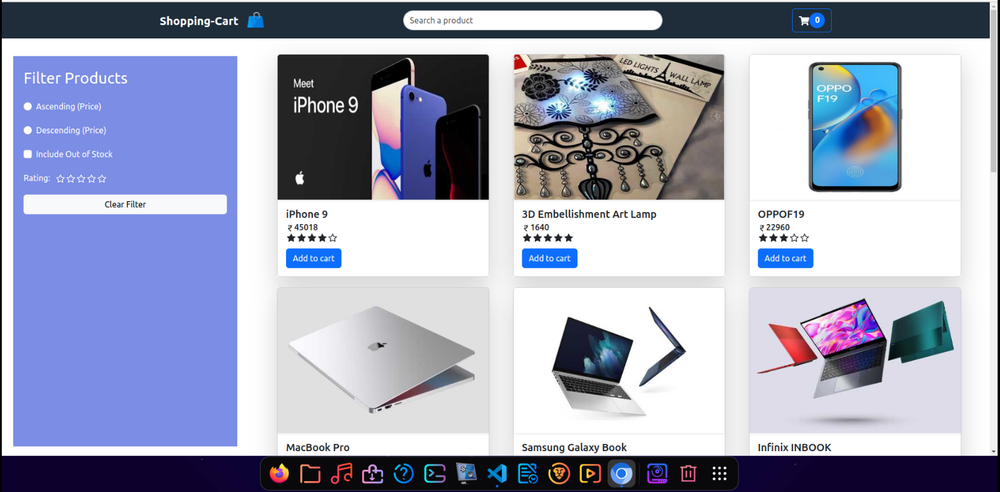

# Welcome to React Shopping Cart!

## A Mini Shopping Cart App

This is a Mini Shopping Cart app build with ReactJs with all the E-commerce functionalities like Filter, Search, Sorting, Rating, AddToCart and so on.
Technologies I have used in this project are given below.

#Technologies 👇

## React 🔥

## Context Api 🔥

## React Router Dom 🔥

## Bootstrap 5 🔥

## Available Scripts 🔥

In the project directory, you can run:

### `Clone the repo`

### `npm install`

### `npm start`

Runs the app in the development mode.\
Open Android Emulator to run this project.

